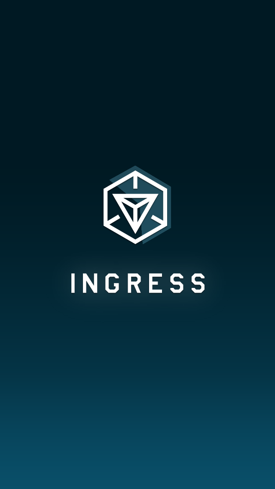
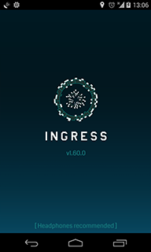
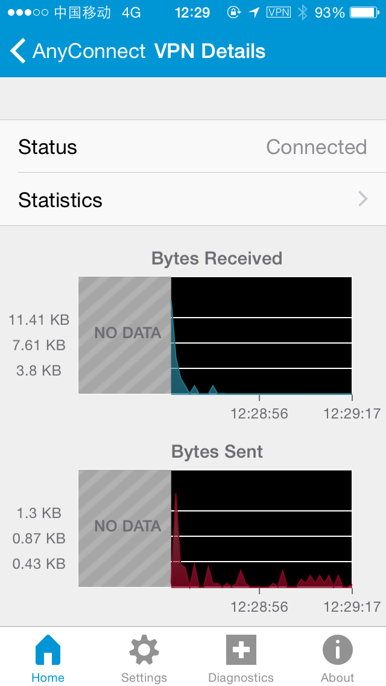
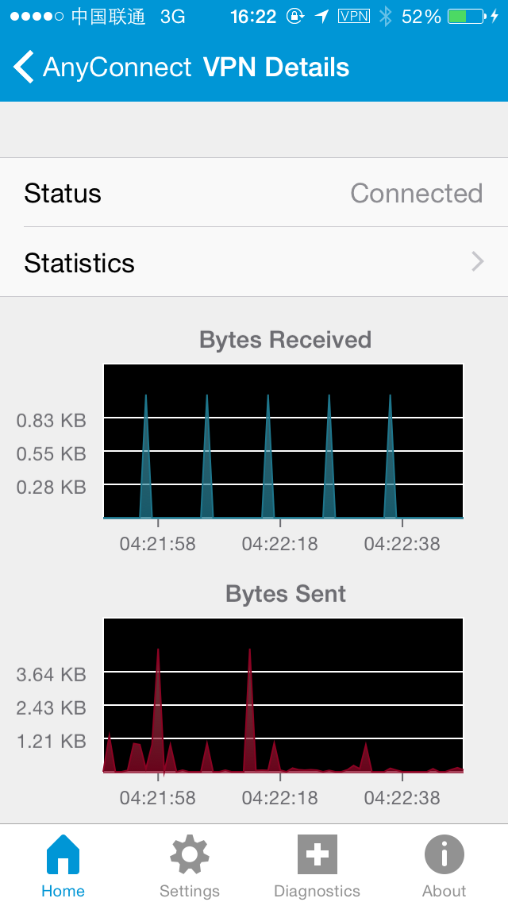

# 中国大陆玩家特别说明

由于特殊的国情，Ingress 又是个由 Google 开发和维护的游戏，相比国外玩家，国内玩家需要面对一些特有的问题。

## 翻墙

由于 Ingress 服务器架设于 Google App Engine，翻墙是进入游戏的必备条件。

翻墙不够稳定或者网速极慢时可能出现以下情况：

 * 进入游戏时卡在启动画面或加载界面（如下图），显示无法建立安全连接，或显示该帐号不可用（此基本为 iOS 特有）
 * 在 Scanner 界面显示 Scan failed，或无法加载正确的地图
 * 访问 Inventory 时显示 No items
 * 访问个人信息和 Mission 等时显示 Transmission interrupted
 * Hack 或者 Deploy 等操作无法完成
 * COMM 不刷新，不显示任何信息或消息发出后不在消息记录中显示

 

**出于长期稳定游戏的考虑，通常不建议依赖于单一的公共免费翻墙通道。**

下面介绍不同平台下常用的翻墙解决方案。

### Android

Android 设备翻墙通常比较简单，可选择的服务也比较多。

#### Shadowsocks

目前较为稳定和使用较为广泛的是 [Shadowsocks](http://shadowsocks.org/)，该项目能稳定工作在多个平台，Android 上工作也非常稳定快速，同时，在 Android 5.0 及以上的设备上，其可以不需要 root 权限便工作在支持分应用代理的 VPN 模式下，Android 5.0 以下的设备也可以以中国路由的模式工作在 VPN 模式下。

Shadowsocks 项目本身仅提供协议和服务器 / 客户端实现，本身并未提供任何可以实现翻墙的服务器，此部分可以通过购买各类翻墙服务商提供的付费服务器或者自己租用 VPS 搭建服务器端实现。该部分不在本教程该范围内，请自行搜索或者咨询当地其它玩家。

Shadowsocks 在 Android 上的客户端有两种：

 * 由 Shadowsocks 团队维护的官方客户端，你可以从 [官方下载地址](https://github.com/shadowsocks/shadowsocks-android/releases) 或者 [Google Play](https://play.google.com/store/apps/details?id=com.github.shadowsocks) 下载，需要 Android 4.0 以上（支持情况因设备而异），大小约 3.5MB。

 * 由 fqrouter 维护的 fqrouter2，你可以从 [官方下载地址](https://s3-ap-southeast-1.amazonaws.com/fqrouter/fqrouter-latest.html) 或者从 [Google Play](https://play.google.com/store/apps/details?id=fq.router2) 下载，需要 Android 2.3 以上（4.0 以下必须 root），大小约 9MB。

两者均可以在 root / 非 root 模式下正常工作，其中后者有多服务器自动切换，共享可翻墙热点等额外功能，但可能在功耗上较前者稍高。

#### SmartProxy（HTTP 代理）

[SmartProxy](http://smartproxy.me/) 是一款使用 Android VPN API 连接 HTTP 代理的应用，你可以从 [Google Play](https://play.google.com/store/apps/details?id=me.smartproxy) 或者从 [官方下载](http://smartproxy.me/app/SmartProxy.apk) 下载，需要 Android 4.0 以上，大小约 500K。

注：SmartProxy 需要 [配置文件](http://smartproxy.me/config.html) 才能正常工作，并不适合普通用户。

#### ShadowVPN

[ShadowVPN](https://shadowvpn.org/) 是一种轻量级的 VPN，你可以从 [Google Play](https://play.google.com/store/apps/details?id=clowwindy.shadowvpn) 下载，或者从 [项目主页](https://github.com/clowwindy/ShadowVPNAndroid) 下载源代码自行编译。需要 Android 4.0.3 及以上，大小约 500K。

ShadowVPN 项目本身仅提供协议和服务器 / 客户端实现，本身并未提供任何可以实现翻墙的服务器，此部分可以通过购买各类翻墙服务商提供的付费服务器或者自己租用 VPS 搭建服务器端实现。该部分不在本教程该范围内，请自行搜索或者咨询当地其它玩家。

**这个项目目前处于 Beta 阶段，请不要在需要高稳定性的场合使用。**

#### PPTP/L2TP/IPSec/OpenVPN/AnyConnect

详见下文。

### iOS

iOS 由于系统限制，Shadowsocks 并不能在非越狱的设备上稳定工作，因此，VPN 几乎是非越狱 iOS 设备的唯一选择，你可以选择自行搭建或者购买商业服务。

#### 通过已翻墙的 Android 设备或者 Mobile Wi-Fi 设备上网

此方法在此不详述。

#### PPTP

iOS 原生支持的 VPN 协议之一。比较古老的 VPN 协议，易受干扰且很挑网络环境，不建议作为主要翻墙方式。

少数 VPN 应用使用这类方案。

#### L2TP/IPSec 和 Cisco IPSec

iOS 原生支持的 VPN 协议之一。能在多数网络环境下正常工作，但仍有被干扰的可能，可通过描述文件实现自动连接和简单的路由配置。易掉线，且由于 Ingress 强制全屏，掉线不易被发现。

目前大多数 VPN 应用使用这类方案。

#### OpenVPN

仅有的两个能在 iOS 上使用的第三方 VPN 协议之一，客户端可在 [App Store](https://itunes.apple.com/us/app/openvpn-connect/id590379981?mt=8) 下载，支持持续连接，支持路由表设定，但其已引起墙的注意，部分网络下可能受到干扰。

#### AnyConnect

仅有的两个能在 iOS 上使用的第三方 VPN 协议之一，客户端可在 [App Store](https://itunes.apple.com/us/app/cisco-anyconnect/id392790924?mt=8) 下载，支持持续连接，支持下发一定数量的路由表，是目前 iOS 上最稳定的 VPN 协议，但仍有部分网络受干扰的报告。

某些情况下 AnyConnect 完成身份验证以后会被阻断，表现为 VPN 显示开启状态但是全局无法访问网络。查看流量可见 Bytes Received 几乎为 0（如下图）。这种情况的原因未知，一说为所在区域移动网络基站配置错误导致 UDP 包无法被正确转发。可以尝试更换运营商，更换网络模式（2G/3G/4G，可以[尝试在身份验证阶段和完成身份验证后使用不同的网络模式](https://www.v2ex.com/t/176263#reply10)）或离开该基站覆盖范围再尝试连接。

 

#### 全局 HTTP 代理 / APN / 转换为 HTTP 代理服务器的 Shadowsocks

由于 Ingress 用户认证过程可能不能被 HTTP 代理，使用这种方式时需要用任一 VPN 进入游戏，此后一段时间内可断开 VPN。如果游戏中出现任何操作都失败的情况，请 Kill Ingress（在最近使用的应用程序界面滑动删除），连接 VPN，重新进行用户认证即可断开 VPN。

你可以使用的翻墙方式：

 * 针对特定 Wi-Fi 的全局 HTTP 代理（仅适用于该 Wi-Fi）
 * APN（仅适用于手机数据，并且需要通过配置文件写入，不建议普通用户操作）
 * 针对所有网络的全局 HTTP 代理（需要将 iOS 设备设为 Supervised Device 并且写入配置文件，不建议普通用户操作）
 * 修改 [shadowsocks-ios](https://github.com/shadowsocks/shadowsocks-iOS) 的源代码并重新编译使其能够作为本地 HTTP 代理后台运行（需要 iOS 开发者账户，不建议普通用户操作）
 * 越狱用户可以使用 [MobileShadowsocks](https://github.com/linusyang/MobileShadowSocks) ，可在 Cydia 官方源内搜索 Shadowsocks 安装

 **除 AnyConnect 外，其它协议建议准备不同类型的备用翻墙方式，以避免关键时刻进不了游戏的尴尬。**

## 地图偏移

由于中国国家测绘局的相关规定，所有中国的电子地图均存在一定程度的[非线性偏移](http://baike.baidu.com/view/3163334.htm)，表现在 Ingress 里即为游戏里及 Intel 地图上显示的地图和 Portal 及玩家实际位置存在一定的偏移，关于此，需要注意以下几点。

 * 游戏内地图显示的道路不可信
 * 所有 Portal 位置也存在相应偏移，即 Portal 按实际地理位置（而非地图上的位置）为准
 * Intel 地图上显示的地图不可信，卫星图可信
 * 申请新 Portal 调整位置时，Android 上务必以卫星图为准，iOS 上不一定可信，如有条件请站在 Portal 实际位置并调整 Portal 位置到地图上标识当前位置的蓝点处
 * 如果安装了 [Google Maps SDK Drifting Fix for China (应用内嵌谷歌地图纠偏)](http://repo.xposed.info/module/com.oasisfeng.google.maps.rectify) 插件，在申请新 Portal 时请务必停用或改用 [修改后](https://docs.google.com/file/d/0BxNnvIFWQpP2aWdCTkdqUXdnekk/edit) 的插件

## Google Play Service （仅 Android）

[Google Play Service](https://play.google.com/store/apps/details?id=com.google.android.gms) 作为 Ingress 在 Android 上的依赖项，在国行设备上没有预装，需要通过刷机或通过各类 Google 服务安装器装入（可能需要 root，可能导致保修失效，后果自负）。

如果你不能判断你的设备是否有 Google Play Service，可安装任一 Google 官方应用，如 Google Maps 判断，如果应用不能正常运行，通常即为未安装或版本过老。

## 定位服务（仅 Android）

出于反作弊等原因考虑，Android 平台的 Ingress 只接受使用 Google 自己的服务进行辅助定位。部分国内厂商或国行设备的 ROM 可能使用百度的定位服务，极可能导致封号。

**如果发现游戏出现如下提示，请务必停止游戏并检查你的定位服务。**

（感谢 Fatiao 提供图片）
