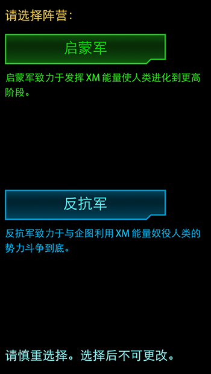

#阵营选择

在游戏开始时，您将选择您的阵营。INGRESS游戏由反抗军与启蒙军两大阵营组成。
您可以在查看初步简介后选择阵营。一旦做出选择，你便无法更改（后续章节将介绍更改阵营）。

反抗军（蓝军）
---
抵抗军始终贯彻维护人性的神圣不可侵犯，XM这种未知的物质必须要以非常严谨的态度去对待。人类至今还未能解明XM的大量涌现对世界造成的影响。启示军对XM对于人类未来的伤害一无所知，并企图利用XM来引发所谓的人类革新，在没有彻底解开EXOTIC MATTER的真面目之前，我们将坚持为捍卫人性而战斗。

启蒙军（绿军）
---
启蒙军坚信，XM应该得到充分的利用，推动人类的进步和发展。反抗军却把它视作威胁，顽固抵制。我们主张进步，为知识而战。只要人类还没有完全掌握XM，只要它还没能发挥出真正的潜力，我们将战斗不息。
