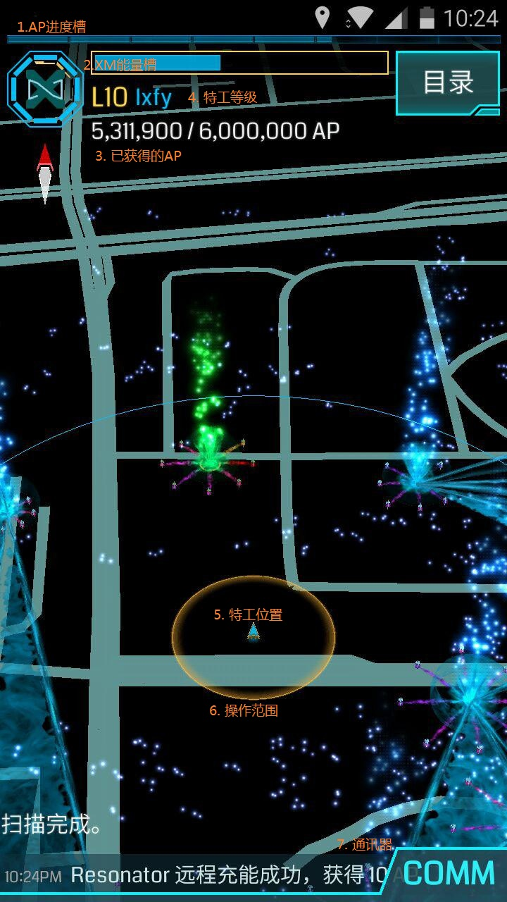

#Scanner 概述

下面介绍一下Scanner的主界面，它看起来应该是这样的。

1. AP进度槽
当您你获得AP时进度条将缓慢前进直至升到下一个等级。
2. XM能量槽
显示您收集了多少XM。几乎所有操作都要消耗一定量的XM，因此尽可能地保存足够的XM吧。
3. 已获得的AP
点击特工名可显示目前已获得AP。左边的数字为当前AP数量，右边的数字为升级到下一个等级所需要的AP数。
4. 特工等级
显示特工当前的等级。
5. 特工位置
显示特工当前的位置。
6. 操作范围
特工可以在当前范围内对portal以及地上的物品进行操作。
7. 通讯器
通讯器用于与其他特工交流，以及查看附近portal活动情况。同时，当其他特工对您占有的portal进行攻击时您也会收到提醒。

