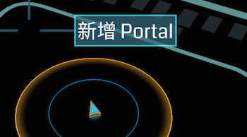

#提交新的 Portal

> 目前（1.98.1）版本已经关闭了全球范围内的portal申请，因此请等待后续开放申请后再尝试提交新portal。

您可以直接通过侦测器定位、拍照和提交候选 Portal，从而帮助我们拓展游戏领域。

您提交的portal应满足[候选标准](https://support.google.com/ingress/answer/3066197?&ref_topic=2799270)。

提交方法：
---

1. 在Scanner中长按你想要候选 Portal 在此显示的地方。向右拖动以选择新 Portal，此时系统会启动设备的相机。
2. `拍摄照片`并进行确认。
3. 在确认位置下，确保候选 Portal 的`位置正确无误`。如果位置不正确，或者您看到了需要位置的消息，请触摸地图并进行拖动，以将标记对准候选据点的所在地。
4. 在名称字段中`输入简短标题`（即建筑物、雕像、艺术品等物体的名称）。
5. 输入有关候选 Portal 的说明 （可选）。您可以使用`说明字段`提供有关候选据点意义和历史方面的其他信息。
6. 触摸发送即可提交你的候选 Portal 以供审核。

