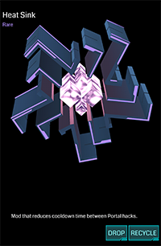
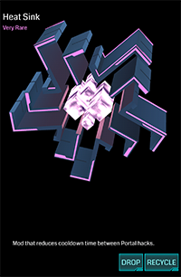

# Heat Sink



用于缩短两次 Hack 时间间隔且重置冷却的道具。

## 基本参数

| 属性 | 值 |
|-|-|
| 掉率 | Common, Rare, Very Rare |
| 占用空间 | 1 |
| 等级 | 无 |
| 可叠加 | 相同掉率 |
| 排序方式 | 掉率 |
| 操作 | Install/Drop/Recycle |

## 功能

Heat Sink 能缩短两次 Hack 之间的时间间隔，其有 Common, Rare, Very Rare 3个级别，分别减少 20%，50% 和 70% 的时间间隔。如一个 Portal 没有任何 Heat Sink Mod 时，两次 Hack 之间需要间隔5分钟以上，当插有一个 Rare 级别的 Heat Sink 时，仅需要2.5分钟即可再次 Hack，这对于快速 Farm 有着比较重要的意义。

此外，Heat Sink 还可以立刻重置当前 Hack 的冷却时间，还包括 Burn out 的计时。因此其在迫切需要获得 Portal Key 的时候有着比较明显的意义。

## 衰减

除效果最强的一个外，其余均减半。

## 习惯用法

 * 在自己经常可以 Hack 的 Portal 上安装
 * 在外做 Field 时，迫切需要某个 Portal 的 Key

## 安装消耗

根据掉率不同，使用分别消耗 400, 800 和 1000 XM。

