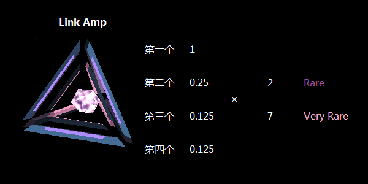

# Link Amp

用于增加 Portal Link 距离上限的道具。

## 基本参数

| 属性 | 值 |
|-|-|
| 掉率 | Rare, Very Rare |
| 占用空间 | 1 |
| 等级 | 无 |
| 可叠加 | 相同掉率 |
| 排序方式 | 掉率 |
| 操作 | Install/Drop/Recycle |

## 功能

Link Amp 可以成倍增加 Portal Link 距离的上限，Rare 及 Very Rare 级别分别为 2 倍及 7 倍。

Link Amp 通过 Hack 只能获得 Rare 等级的，Very Rare 级别需要通过 Passcode 获得。

## 衰减

第二个即衰减为 1/4，第三个开始仅有 1/8 的效果。

## 缺点

 * 由于一般 Portal 的 Link 距离已经能满足绝大部分 Field 的需要，多数情况下并不需要用到。
 * 大范围 Field 需要的 Very Rare 级别的 Link Amp 获得不易。

## 习惯用法

 * Recycle 掉
 * 作为垃圾 Mod 随手往 Portal 上插，刷 Engineer 成就

## XM 当量

### Install

| 掉率 | XM |
|-|-|
| Rare | -800 XM |
| Very Rare | -1000 XM |

### Recycle

| 掉率 | XM |
|-|-|
| Rare | +80 XM |
| Very Rare | +100 XM |
