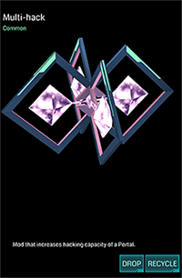
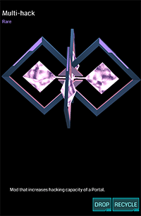
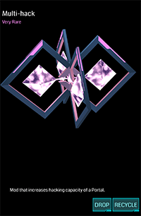

# Multi-hack



用于增加 Hack 次数上限的道具。

## 基本参数

| 属性 | 值 |
|-|-|
| 掉率 | Common, Rare, Very Rare |
| 占用空间 | 1 |
| 等级 | 无 |
| 可叠加 | 相同掉率 |
| 排序方式 | 掉率 |
| 操作 | Install/Drop/Recycle |

## 功能

Multi-hack 可用于增加 Portal 每 4 小时 Hack 次数的上限，没有任何道具加成的情况下为 4 次（关于 Hack 及具体限制，参见相关条目）。

共有 Common, Rare, Very Rare 3个级别，分别增加 4 次，8 次和 12 次 Hack 次数。

## 衰减

除效果最强的一个外，其余均减半。

## 习惯用法

 * 在自己经常可以 Hack 的 Portal 上安装

## XM 当量

### Install

| 掉率 | XM |
|-|-|
| Common | -400 XM |
| Rare | -800 XM |
| Very Rare | -1000 XM |

### Recycle

| 掉率 | XM |
|-|-|
| Common | +40 XM |
| Rare | +80 XM |
| Very Rare | +100 XM |
