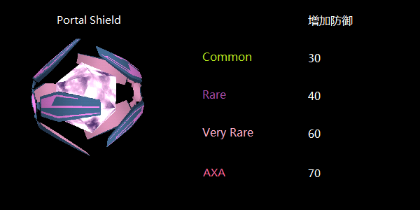

# Portal Shield / AXA Shield



用于增加 Portal 防御的道具。

## 基本参数

| 属性 | 值 |
|-|-|
| 掉率 | Portal Shield：Common，Rare，Very Rare；AXA Shield：Very Rare |
| 占用空间 | 1 |
| 等级 | 无 |
| 可叠加 | 相同掉率 |
| 排序方式 | 掉率 |
| 操作 | Install/Drop/Recycle |

## 功能

Portal Shield 和 AXA Shield 能提高 Portal 防御敌方 XMP 攻击的能力。其中 Common, Rare 和 Very Rare 的 Portal Shield 分别能提高 30，40 和 60 的防御，而 AXA Shield 则能提高 70 的防御。

## 衰减

Shiled 道具无衰减。

## 习惯用法

 * 在需要保护的 Portal 上安装

## XM 当量

### Install

| 掉率 | XM |
|-|-|
| Common | -400 XM |
| Rare | -800 XM |
| Very Rare | -1000 XM |
| AXA | -1000 XM |

### Recycle

| 掉率 | XM |
|-|-|
| Common | +40 XM |
| Rare | +80 XM |
| Very Rare | +100 XM |
| AXA | +100 XM |

## 备注

AXA Shield 为 NIA 与 法国安盛保险（AXA）合作产物，在各地安盛保险的网点 Portal，Hack 有更高概率获得（大陆似乎没有）。
