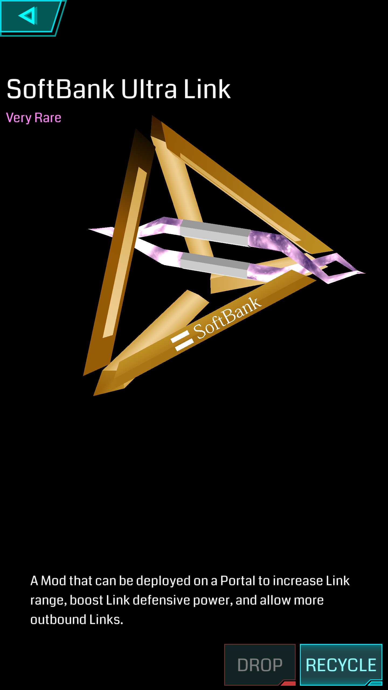

# Softbank Ultra Link

用于大量增加 Portal Link 距离上限的道具，主要用在大行动中。

## 基本参数

| 属性 | 值 |
|-|-|
| 掉率 | Very Rare |
| 占用空间 | 1 |
| 等级 | 无 |
| 可叠加 | 相同掉率 |
| 排序方式 | 掉率 |
| 操作 | Install/Drop/Recycle |

## 功能

Softbank Ultra Link 可以成倍增加 Portal Link 距离的上限，第一个增加5倍。

## 衰减

第二个即衰减为 1/4，第三个开始仅有 1/8 的效果。

## XM 当量

### Install

| 掉率 | XM |
|-|-|
| Very Rare | -1000 XM |

### Recycle

| 掉率 | XM |
|-|-|
| Very Rare | +100 XM |

## 备注

Softbank Ultra Link 为 NIA 与 日本软银（Softbank）合作产物。
