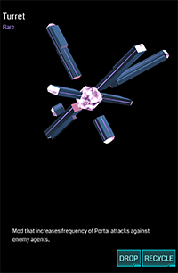

# Turret



用于增加 Portal 反击频率的道具。

## 基本参数

| 属性 | 值 |
|-|-|
| 掉率 | Rare |
| 占用空间 | 1 |
| 等级 | 无 |
| 可叠加 | 相同掉率 |
| 排序方式 | 掉率 |
| 操作 | Install/Drop/Recycle |

## 功能

Turret 能增加 Portal 反击的频率和额外的 Hit Bonus，目前仅有 Rare 级别，效果为 +2x 攻击频率，+30% Hit Bonus。通常建议和 Force Amp 一起使用。

## 衰减

第二个即衰减为 1/4，第三个开始仅有 1/8 的效果，但其 Hit Bonus 不产生递减（待确认）。

## 习惯用法

 * 在需要保护的 Portal 上安装

## XM 当量

### Install

-800 XM

### Recycle

+80 XM
