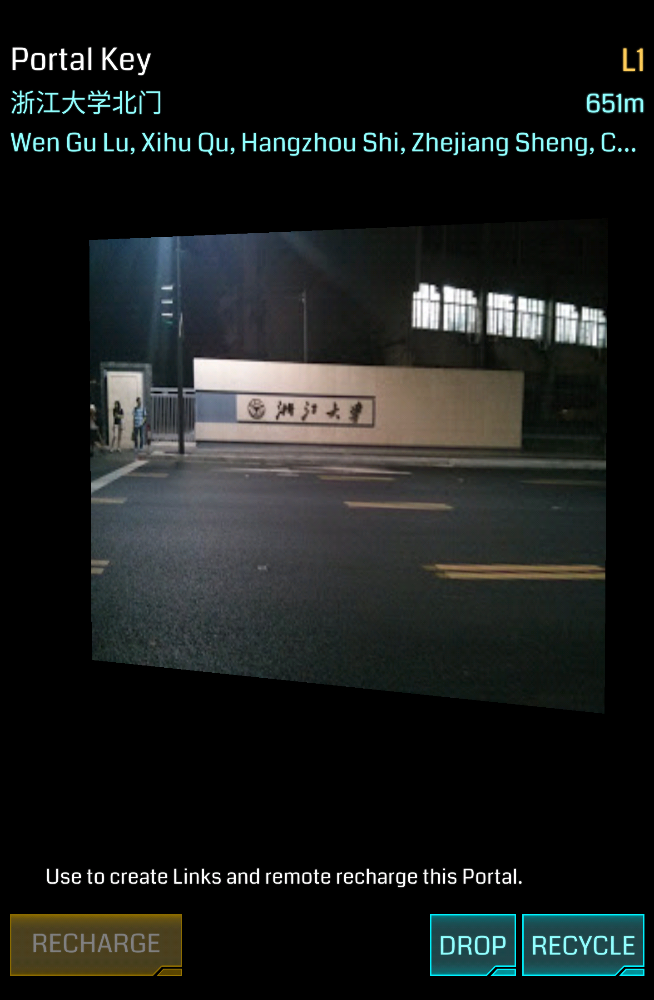

# Portal Key

用于 Link 和 远程 Recharge 的重要道具。

## 基本参数

| 属性 | 值 |
|-|-|
| 掉率 | 无 |
| 占用空间 | 1 |
| 等级 | 无 |
| 可叠加 | 仅相同 Portal |
| 排序方式 | Distance/Title(Unicode) |
| 操作 | Recharge/Drop/Recycle |

## 功能

不同 Portal 的 Key 视为不同的道具。

用于远程 Recharge，可反复使用，视距离远近有所衰减，且最远距离受玩家等级限制。

用于 Link，每次 Link 均会消耗目标 Portal 的一把 key。

## 特殊获得情况

Portal Key 获得方式主要也是通过 Hack，但与其它道具有所不同，若包内已持有对应 Portal 的 Key，不会再次获得同一 Portal 的 Key，放于 Capsule 里的 Key 视作未持有。

## 习惯用法

* 储备重要端点的 Portal Key

## XM 当量

### Recycle

+500 XM
