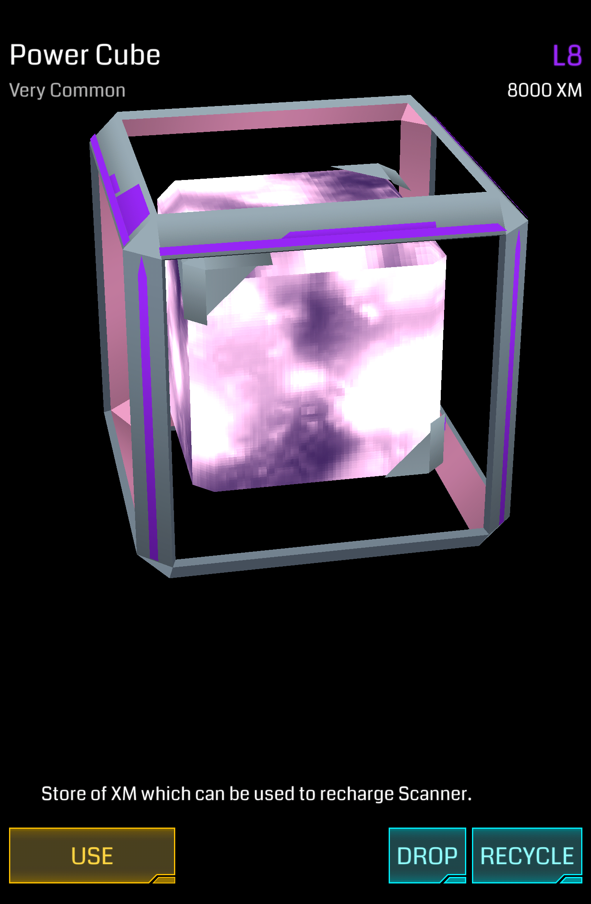

# Power Cube

Power Cube 是快速补充 XM 的道具。

## 基本参数

| 属性 | 值 |
|-|-|
| 掉率 | Very Common |
| 占用空间 | 1 |
| 等级 | L1 - L8 |
| 可叠加 | 同等级 |
| 排序方式 | 无 |
| 操作 | Use/Drop/Recycle |

## 功能

点击 Use 即快速回复相应等级的 XM，是 Agent 在攻击和防御过程中恢复 XM 的主要手段。

## Hack 产出

Hack Portal 时能获得自身等级和 Portal 等级两者之中较低者的 Power Cube。

## XM 当量

### Use

| 等级 | XM |
|-|-|
| L1 | +1000 XM |
| L2 | +2000 XM |
| L3 | +3000 XM |
| L4 | +4000 XM |
| L5 | +5000 XM |
| L6 | +6000 XM |
| L7 | +7000 XM |
| L8 | +8000 XM |

### Recycle

| 等级 | XM |
|-|-|
| L1 | +1000 XM |
| L2 | +2000 XM |
| L3 | +3000 XM |
| L4 | +4000 XM |
| L5 | +5000 XM |
| L6 | +6000 XM |
| L7 | +7000 XM |
| L8 | +8000 XM |
