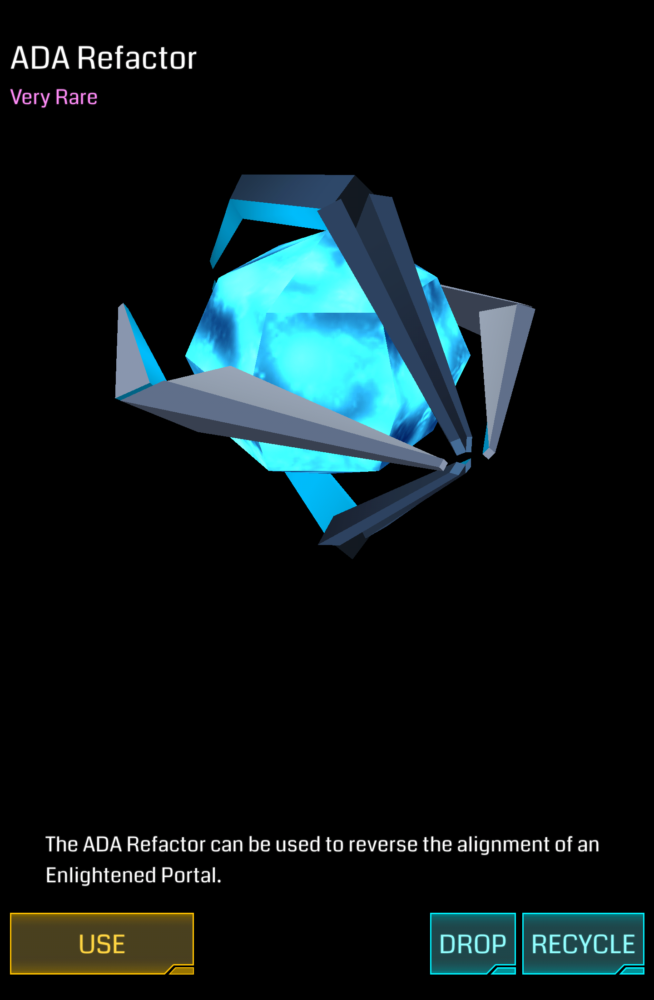
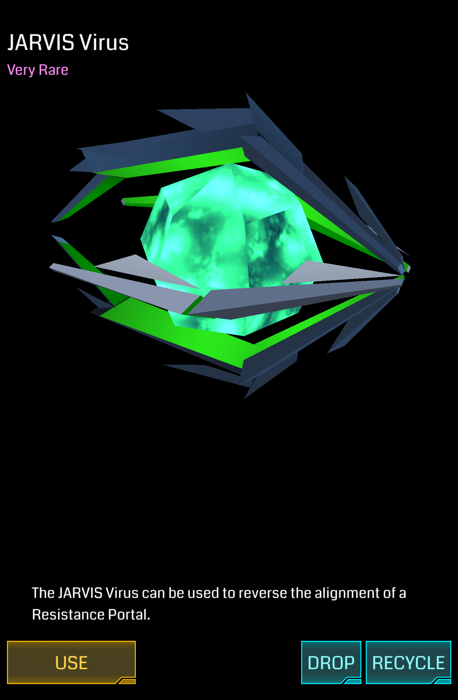

# ADA Refactor/Jarvis Virus

直接转换 Portal 阵营的武器类道具。

| 属性 | 值 |
|-|-|
| 掉率 | Very Rare |
| 占用空间 | 1 |
| 等级 | 无 |
| 可叠加 | 同道具 |
| 排序方式 | 无 |
| 操作 | Use/Drop/Recycle |

## 功能

直接将目标 Portal 转换为对应阵营。

ADA Refactor 将转换 Portal 至 Resistance，Jarvis Virus 将转换 Portal 至 Enlightened。

如果转换为已方阵营，则 Portal Owner 及所有 Resonator， Mod 所有者均为自己，若转换为敌方阵营，则根据阵营不同，显示为对应的阵营领袖 ID (\_\_ADA\_\_ / \_\_JARVIS\_\_)。

*注意：使用 ADA Refactor / Jarvis Virus 摧毁的任何 Resonator、Link 和 Field 不获得任何 AP。*

## 使用限制

* 消耗 XM 小于 XM 上限
* 一小时内 Portal 未被使用过同类道具（连续使用会直接失败，且浪费该道具）

## XM 当量

### Use

ADA Refactor/Jarvis Virus XM 消耗取决于目标 Portal 的等级。

| 等级 | XM |
|-|-|
| L1 | -1000 XM |
| L2 | -2000 XM |
| L3 | -3000 XM |
| L4 | -4000 XM |
| L5 | -5000 XM |
| L6 | -6000 XM |
| L7 | -7000 XM |
| L8 | -8000 XM |

### Recycle

+100 XM