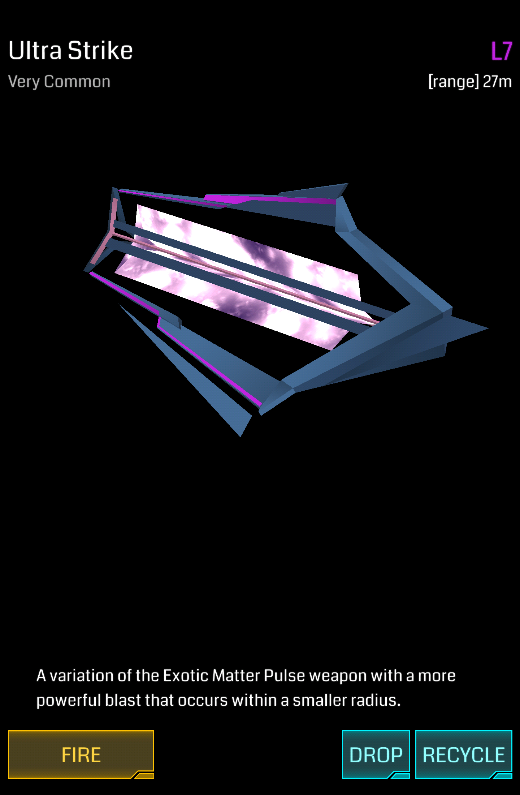

# Ultra Strike



小范围的武器类道具。

## 基本参数

| 属性 | 值 |
|-|-|
| 掉率 | Very Common |
| 占用空间 | 1 |
| 等级 | L1 - L8 |
| 可叠加 | 同等级 |
| 排序方式 | 无 |
| 操作 | Fire/Drop/Recycle |

## 功能

释放 XM 冲击波，伤害并摧毁周围敌对阵营的 Resonator，攻击范围相较同等级 XMP Burster 较小。

## 伤害

此伤害为中心位置伤害，随着距离增加会发生衰减。

| 等级 | 造成伤害|
|-|-|
| L1 | 150 |
| L2 | 300 |
| L3 | 500 |
| L4 | 900 |
| L5 | 1200 |
| L6 | 1500 |
| L7 | 1800 |
| L8 | 2700 |

## 攻击范围

Ultra Strike 所能波及的最大范围，作为参考，玩家脚下的黄圈为 40m。

| 等级 | 最大攻击范围(m)|
|-|-|
| L1 | 10 |
| L2 | 13 |
| L3 | 16 |
| L4 | 18 |
| L5 | 21 |
| L6 | 24 |
| L7 | 27 |
| L8 | 30 |

## Hack 产出

Hack Portal 时能获得自身等级和 Portal 等级两者之中较低者等级的 Ultra Strike。

## 习惯用法

* 在 Resonator 正上方使用，定点清除 Resonator
* 在 Portal 中心使用，快速摧毁 Mod

## XM 当量

### Fire

| 等级 | XM |
|-|-|
| L1 | -50 XM |
| L2 | -100 XM |
| L3 | -150 XM |
| L4 | -200 XM |
| L5 | -250 XM |
| L6 | -300 XM |
| L7 | -350 XM |
| L8 | -400 XM |

### Recycle

| 等级 | XM |
|-|-|
| L1 | +20 XM |
| L2 | +40 XM |
| L3 | +60 XM |
| L4 | +80 XM |
| L5 | +100 XM |
| L6 | +120 XM |
| L7 | +140 XM |
| L8 | +160 XM |